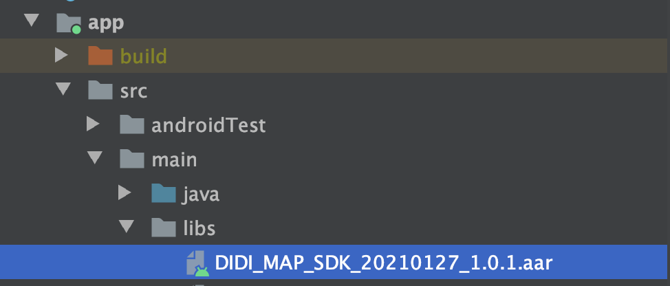

# SDK接入说明

##### 第1步：  需要申请开发者Key，具体申请方式请联系以下邮箱: zhouhu@didiglobal.com

---

##### 第2步：下载开放平台SDK，[下载地址](Name：OPEN_MAP_SDK.aar Link：https://cooper.didichuxing.com/shares/m9Osqn5pqAy9 Password：xKZN)

---

##### 第3步：

1. 将下载的SDK，如 DIDI_MAP_SDK_20210127_1.0.1.aar 放置在 src/main/libs 目录下

    

2. 然后在当前module中build.gradle 配置如下：  

   `implementation(name: "DIDI_MAP_SDK_20210127_1.0.1", ext: "aar")`

---

##### 第4步：然后Sync  Project With Gradle Files,接下来就可以使用标准API

---


### SDK 需要使用的权限如下

//地图包、搜索包需要的基础权限

```
<!-- 允许程序打开网络套接字 -->
<uses-permission android:name="android.permission.INTERNET" />
<!-- 允许程序使用获取网络状态 -->
<uses-permission android:name="android.permission.ACCESS_NETWORK_STATE" />
<!--允许程序获取WIFI状态用于定位 -->
<uses-permission android:name="android.permission.ACCESS_WIFI_STATE" />
<!-- 允许程序使用高精度定位 -->
<uses-permission android:name="android.permission.ACCESS_FINE_LOCATION" />
<!-- 允许程序使用粗精度权限 -->
<uses-permission android:name="android.permission.ACCESS_COARSE_LOCATION" />
<!-- 允许程序访问额外的定位提供者指令获取模拟定位信息 -->
<uses-permission android:name="android.permission.ACCESS_LOCATION_EXTRA_COMMANDS" />
<!-- 允许程序使用蓝牙 -->
<uses-permission android:name="android.permission.BLUETOOTH" />
<!-- 允许程序更改wifi连状态 -->
<uses-permission android:name="android.permission.CHANGE_WIFI_STATE" />
```

