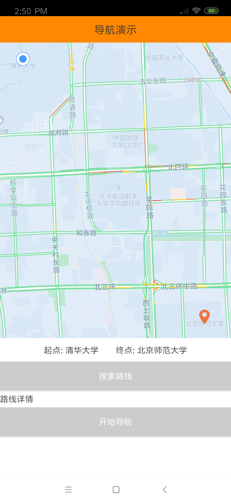
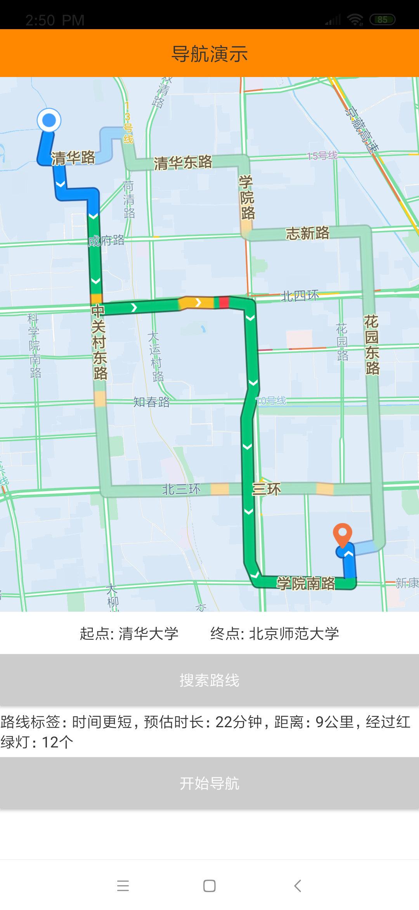
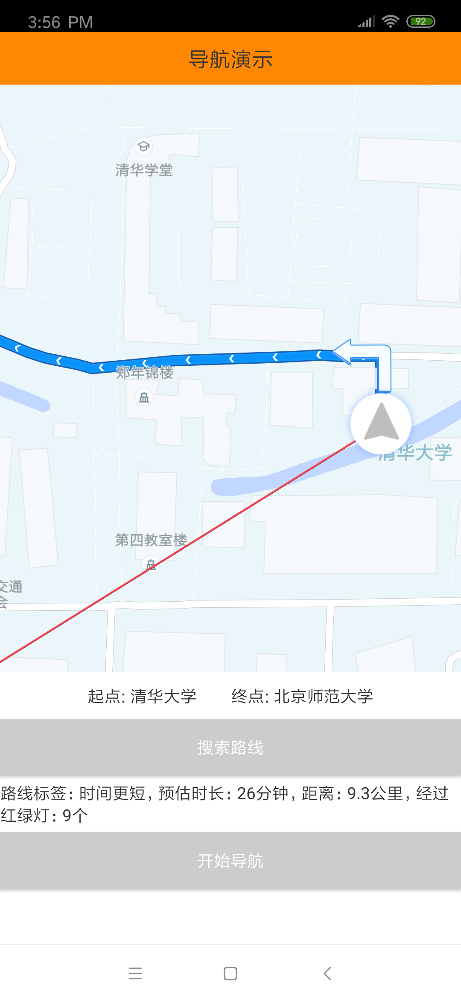

# 导航

​		导航模块是一套由多个功能模块组成的带有完整导航能力的模块化组件，在逻辑上和地图模块完全解耦。导航模块包括路径规划模块和路径导航模块。简单的几个api，和地图模块搭配使用，可以帮助您更简单快捷地将导航能力集成到自己的应用中。

​		路径规划模块是通过起点和终点从多维度计算多条可达路径，比如时间最短路径、距离最短路径、红绿灯最少路径等等。路径规划模块计算好路径之后会输出多条路径的集合，开发人员再通过地图模块的api，将路径集合显示到地图组件上，并且支持用户点击某条路径时的事件监听。

​		路径导航模块是和定位模块配合，通过路径规划模块输出的路径集合中的一条路径，实时引导用户沿着目标路径到达终点。路径导航模块提供了很多回调接口，比如偏航回调、偏航后路径重新规划的回调、行驶过程中路标提示的回调、到达终点的回调等。可以帮助您方便快速地实现自定义的需求。

​		使用地图SDK之前，需要申请开发者key、需要在工程中正确配置aar文件，以及需要在 AndroidManifest.xml 文件中进行相关权限设置，确保地图功能可以正常使用。详情请看“**[SDK接入说明](/static/apimarket-docs/services/地图/SDK/使用文档/SDK接入说明.md)**”。

## 第一步，显示地图

------

​		使用导航功能之前，必须先在界面上绘制出地图。详情请看“**[显示地图](/static/apimarket-docs/services/地图/SDK/使用文档/显示地图.md)**”。

## 第二步，计算路线

------

​		根据实际业务场景获取到起点和终点的经纬坐标，通过OpenNavigation的calculateRoute()方法异步计算路径，回调方法中将会返回一个路径集合。示例代码如下：

```java
private OpenMap mOpenMap;
private OpenNavigation mOpenNavigation;

//起点位置坐标
private OpenLatLng mStartLocation;
//终点位置坐标
private OpenLatLng mTerminusLocation;

 @Override
 protected void onCreate(@Nullable Bundle savedInstanceState) {
 		super.onCreate(savedInstanceState);
    setContentView(R.layout.activity_simple_navi);
    
   	mOpenMapView = findViewById(R.id.open_map_view);
    mOpenMapView.onCreate(savedInstanceState);

    mOpenMapView.getMapAsync(map -> {
    		mOpenMap = map;
        //开启交通路况图层
        mOpenMap.setTrafficEnabled(true);
      	//模拟起点和终点位置，在地图上标记两个位置
      	initPosition();
    });
}

/**
 * 模拟起点和终点位置，在地图的两个位置上添加Marker
 */
private void initPosition() {
  	//模拟起点位置坐标，实际开发中可以根据实际场景获取起点坐标
  	mStartLocation = new OpenLatLng(40.003686, 116.326804);
  	//在起点位置添加Marker
  	Bitmap startMarker = BitmapFactory.decodeResource(getResources(), R.drawable.demo_navi_start_location);
    OpenMarker openMarker = addMarker(mStartLocation, startMarker);
    if (openMarker != null) {
    		//将地图视角移动到起点位置
    		moveToMarker(mStartLocation);
    }
  
  	//模拟终点位置坐标，实际开发中可以根据实际场景获取终点坐标
  	mTerminusLocation = new OpenLatLng(39.961563, 116.365728);
  	//在终点位置添加Marker
  	Bitmap terminusMarker = BitmapFactory.decodeResource(getResources(), R.drawable.demo_navi_terminus_location);
    addMarker(mTerminusLocation, terminusMarker);
}

/**
 * 在地图上的目标位置上添加Marker
 */
private OpenMarker addMarker(OpenLatLng latLng, Bitmap bitmap) {
        if (mOpenMap == null) {
            return null;
        }
        OpenMarkerOptions openMarkerOptions = new OpenMarkerOptions();
  			//自定义Marker的图标
        openMarkerOptions.icon(OpenBitmapDescriptorFactory.fromBitmap(bitmap));
        //Marker添加的位置
  			openMarkerOptions.position(latLng);
        return mOpenMap.addMarker(openMarkerOptions);
}

/**
 * 移动地图视角到目标位置
 */
private void moveToMarker(OpenLatLng openLatLng) {
        if (mOpenMap != null) {
          	return;
        }
        OpenCameraUpdate.CameraUpdateParams cameraUpdateParams = new OpenCameraUpdate.CameraUpdateParams(OpenCameraUpdate.CameraUpdateParams.CameraUpdateType.CENTER_ZOOM);
  			//地图视角移动到的目标位置
        cameraUpdateParams.latLng = openLatLng;
  			//地图缩放比例
        cameraUpdateParams.zoom = 15;
        OpenCameraUpdate cameraUpdate = new OpenCameraUpdate(cameraUpdateParams);
  			//动态移动地图视角到目标位置
        mOpenMap.animateCamera(cameraUpdate);
}

/**
 * 搜索路线
 */
private void searchRoute() {
    if (mOpenMap == null) {
        return;
    }
    mOpenNavigation = new OpenNavigation(this, mOpenMap);
    //算路参数
    OpenNavigation.RouteSearchOptions routeSearchOptions = new OpenNavigation.RouteSearchOptions();
    //算路策略,包括时间优先、高速优先、避面拥堵、避免限行等等策略
    OpenNavigation.RouteSearchStrategy searchStrategy = new OpenNavigation.RouteSearchStrategy();
    //时间优先
    searchStrategy.setTimeFirst(true);
    routeSearchOptions.routeSearchStrategy = searchStrategy;
    //导航起点位置
    routeSearchOptions.start = mStartLocation;
    //导航终点位置
    routeSearchOptions.destination = mTerminusLocation;
  	//开始规划路径
    mOpenNavigation.calculateRoute(routeSearchOptions, new ISearchRouteCallback() {
        @Override
        public void onBeginToSearch() {

        }

        @Override
        public void onFinishToSearch(ArrayList<OpenNaviRoute> routeList, String desc) {
            //路径规划完成后，输出一个路径集合
        }
    });
}
```

运行效果如下：



## 第三步，在地图上显示所有路线

------

上一步骤中已经得到一个路径集合，接下来将路径集合中的全部路径显示到地图上，并且监听点击事件回调给业务方。示例代码如下：

```java
//路径规划成功后，存储所有规划好的路径集合
private ArrayList<OpenNaviRoute> mOpenNaviRoutes = new ArrayList<>();
//存储地图上已经显示的路径集合
private final ArrayList<OpenLine> mOpenLines = new ArrayList<>();
//当前被选择的路径，在地图上高亮显示的路径
private OpenNaviRoute mCurrentPlanRoute;

/**
 * 搜索路线
 */
private void searchRoute() {
  	
		/**
   	 * 省略部分代码
     */
  
		//开始规划路径
    mOpenNavigation.calculateRoute(routeSearchOptions, new ISearchRouteCallback() {
        @Override
        public void onBeginToSearch() {

        }

        @Override
        public void onFinishToSearch(ArrayList<OpenNaviRoute> routeList, String desc) {
            if (routeList != null && !routeList.isEmpty()) {
                mOpenNaviRoutes = routeList;
              	//再地图上添加路线元素，即把路线显示到地图上
                addAllLine(mOpenNaviRoutes, 0);
            } else {
                mOpenNaviRoutes = null;
            }
        }
    });
}

/**
 * 把路径集合中的所有路径显示到地图上，并且使某一条路径高亮
 * @param routeList 显示在地图上的路径集合
 * @param index     需要高亮显示的某一条路径
 */
private void addAllLine(ArrayList<OpenNaviRoute> routeList, int index) {
		//把地图上已经显示的路径全部remove
    if (mOpenLines != null && !mOpenLines.isEmpty()) {
        for (OpenLine polyline : mOpenLines) {
            mOpenMap.remove(polyline);
        }
        mOpenLines.clear();
    }

		//遍历路径集合，依次把所有路径显示到地图上
    for (int i = 0; i < routeList.size(); i++) {
    		final OpenNaviRoute route = routeList.get(i);
        if (i != index) {
          	//在地图上添加路径
            addPolyLine(route, false);
        }
    }

  	//最后在地图上添加高亮的路径
    if (index < routeList.size()) {
        mCurrentPlanRoute = routeList.get(index);
      	//在地图上添加路径
        addPolyLine(mCurrentPlanRoute, true);
    }
}

/**
 * 在地图上添加路径，并且区分路径是否是主选路，主选路在地图上高亮显示
 * @param route    待添加的路径
 * @param selected 是否是主选路
 */
private void addPolyLine(OpenNaviRoute route, boolean selected) {
		if (mOpenMap == null
            || route == null
            || route.getRoutePoints() == null
            || route.getRouteTrafficIndex() == null) {
        return;
    }
  	//将OpenNaviRoute实例手动转换成OpenLineOptions
    OpenLineOptions lineOptions = new OpenLineOptions();
  	//路径上经纬度点集合
    lineOptions.setPoints(route.getRoutePoints());
  	//交通路况颜色集合
    lineOptions.setGetRouteTrafficIndex(route.getRouteTrafficIndex());
  	//交通路况经纬度点集合
    lineOptions.setGetTrafficInsertPoint(route.getTrafficInsertPoint());
  	//设置路径的样式
    lineOptions.setLineType(OpenLineOptions.LineType.LINE_TYPE_MULTICOLORLINE);

    if (selected) {
    		//设置是否在路径上显示向前的箭头
        lineOptions.directionArrow(true);
    		//设置是否是主选路
        lineOptions.setMainRoute(true);
        //添加各个路段的路名
        lineOptions.addAllRoadNames(route.getRouteSectionWithNameList());
        //设置文字颜色
        lineOptions.setTextColorName(OpenLineOptions.TEXTURE_COLOR_NAMES[0]);
    } else {
        lineOptions.directionArrow(false);
        lineOptions.setMainRoute(false);
        lineOptions.addAllRoadNames(route.getRouteSectionWithNameList());
        lineOptions.setTextColorName(OpenLineOptions.TEXTURE_COLOR_NAMES[2]);
    }
    //路径id
    long routeId = Long.parseLong(route.getRouteId());
    lineOptions.routeId(routeId);
  
  	//路径添加到地图中
    OpenLine openLine = mOpenMap.addLine(lineOptions);
  	//设置路径的点击事件监听
    openLine.setOnLineClickListener(mRouteClickListener);
  	//存储地图上显示的路径
    mOpenLines.add(openLine);
}

/**
 * 地图上路径被点击的事件监听
 */
private final OpenMap.OnLineClickListener mRouteClickListener = new OpenMap.OnLineClickListener() {
    @Override
    public void onLineClick(OpenLine line) {
      	//当前已经被选择的路径id
        long currentId = Long.parseLong(mCurrentPlanRoute.getRouteId());
      	//被点击的路径id
        long clickedId = ((OpenLineOptions) line.getOptions()).getRouteId();
    		//点击的路径正式已经被选择的id
        if (currentId == clickedId) {
            return;
        }

        //点击的路径是其他路径
        for (int i = 0; i < mOpenNaviRoutes.size(); i++) {
            if (clickedId == Long.parseLong(mOpenNaviRoutes.get(i).getRouteId())) {
                //在集合中找到点击路径，在地图上重新添加路径
                addAllLine(mOpenNaviRoutes, i);
                return;
            }
        }
    }
};
```

运行效果如下：




## 第四步，启动导航

------

最后，调用OpenNavigation的startNavi()方法，传入选择好的一条路径，即可启动导航。在Activity的onDestroy()方法、或者到达终点后、或者业务相关的其他场景，务必要调用OpenNavigation的stopNavi()方法结束导航程序。示例代码如下：

```java
/**
 * 开始导航
 */
private void startNavi() {
  	//清除地图上添加所有元素
    clearElement();
    if (mOpenNavigation != null && mCurrentPlanRoute != null) {
      	//传入当前路径，开始导航
        mOpenNavigation.startNavi(mCurrentPlanRoute);
    }
}

/**
 * 清除地图上添加所有元素。即之前添加的起终点Marker和所有路径
 */
private void clearElement() {
    if (mOpenLines != null && !mOpenLines.isEmpty()) {
      	//清除地图上添加所有元素。即之前添加的起终点Marker和所有路径
      	if (mOpenMap != null) {
          	mOpenMap.clear();
        }
        mOpenLines.clear();
    }
}

@Override
protected void onDestroy() {
    super.onDestroy();
  	//停止导航
    if (mOpenNavigation != null) {
        mOpenNavigation.stopNavi();
    }
}
```

开启导航后，运行效果如下：


