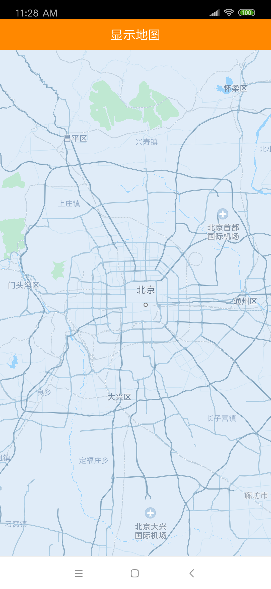

# 显示地图

使用地图SDK之前，需要申请开发者key、需要在工程中正确配置aar文件，以及需要在 AndroidManifest.xml 文件中进行相关权限设置，确保地图功能可以正常使用。详情请看“**[SDK接入说明](/static/apimarket-docs/services/地图/SDK/使用文档/SDK接入说明.md)**”。

## 第一步，初始化地图SDK

------

新建一个自定义的Application，在其onCreate方法中完成SDK的初始化。示例代码如下：

```java
public class OpenDemoApp extends Application {

    @Override
    public void onCreate() {
        super.onCreate();
        //在使用SDK各组件之前，必须先初始化SDK
        //参数说明：
      	//第一个参数：context 			context信息。传入ApplicationContext。
      	//第二个参数：debug   			是否开启调试模式。true：开启； false：不开启  编译release包时，请务必传入false。
      	//第三个参数：userKey 			之前申请的开发者key。请确保传入的key正确，否则不能正常使用地图功能。
      	//第四个参数：initCallback	初始化结果的回调。如果不关心结果，可以传入null。
        OpenSDK.init(this, false, userKey, new OpenSDK.OpenSDKInitCallback() {
            @Override
            public void onInited(boolean success, String tips, String deviceId) {
                //初始化结果的回调
            }
        });
    }
}
```


## 第二步，在xml布局文件中添加地图容器

------

OpenMapView是Android View的一个子类，用于在Android View中放置地图。OpenMapView的使用方法与Android提供的其他View一样，示例代码如下：

```java
<com.didi.open.map.api.OpenMapView
    android:id="@+id/open_map_view"
    android:layout_width="match_parent"
    android:layout_height="match_parent" />
```

## 第三步，创建地图Activity，管理OpenMapView的生命周期

------

在项目中使用地图的时候需要注意，合理的管理地图生命周期，至关重要。示例代码如下：

```java
public class MainActivity extends AppCompatActivity {
		//地图控件
  	private OpenMapView mOpenMapView = null;
  	
  	@Override
    protected void onCreate(@Nullable Bundle savedInstanceState) {
        super.onCreate(savedInstanceState);
        setContentView(R.layout.activity_main);
				//获取地图控件的引用
        mOpenMapView = findViewById(R.id.open_map_view);
        //在activity执行onCreate()时执行mOpenMapView.onCreate(savedInstanceState)，创建地图
       	mOpenMapView.onCreate(savedInstanceState);
    }
  
  	@Override
    protected void onStart() {
        super.onStart();
      	//在activity执行onStart()时执行mOpenMapView.onStart()，开始地图的绘制
        mOpenMapView.onStart();
    }

    @Override
    protected void onResume() {
        super.onResume();
        //在activity执行onResume()时执行mOpenMapView.onResume()，重新恢复地图的绘制
        mOpenMapView.onResume();
    }

    @Override
    protected void onPause() {
        super.onPause();
				//在activity执行onPause()时执行mOpenMapView.onPause()，暂停地图的绘制
       	mOpenMapView.onPause();
    }

    @Override
    protected void onStop() {
        super.onStop();
				//在activity执行onStop()时执行mOpenMapView.onStop()，停止地图的绘制
       	mOpenMapView.onStop();

    }

    @Override
    protected void onDestroy() {
        super.onDestroy();
				//在activity执行onDestroy()时执行mMapView.onDestroy()，销毁地图控件
       	mOpenMapView.onDestroy();
    }
}
```

完成以上工作即可在您的应用中显示地图了。运行后的效果如下图所示：


