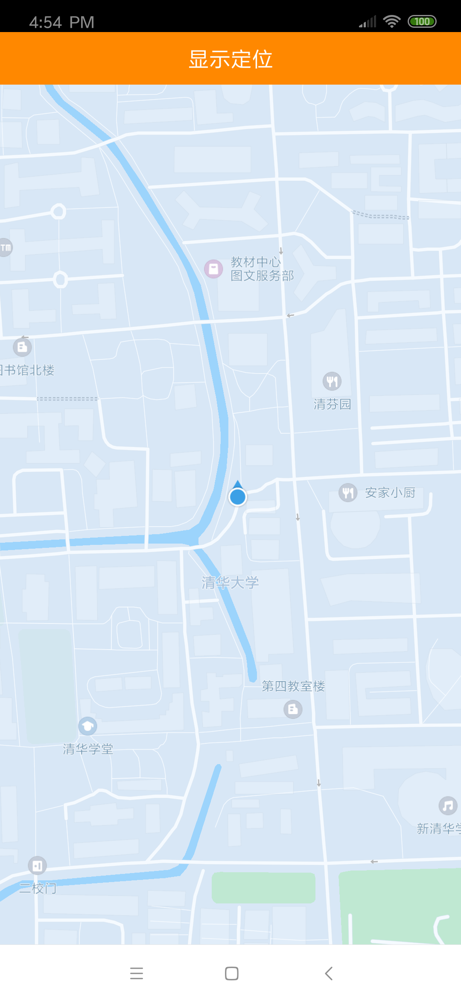

# 显示定位

使用地图SDK之前，需要申请开发者key、需要在工程中正确配置aar文件，以及需要在 AndroidManifest.xml 文件中进行相关权限设置，确保地图功能可以正常使用。详情请看“**[SDK接入说明](/static/apimarket-docs/services/地图/SDK/使用文档/SDK接入说明.md)**”。

## 第一步，显示地图

------

在地图上显示定位的之前，必须先在界面上绘制出地图。详情请看“**[显示地图](/static/apimarket-docs/services/地图/SDK/使用文档/显示地图.md)**”。

## 第二步，为地图设置定位源

------

首先通过OpenMapView的getMapAsync()方法异步获取到OpenMap的实例。

OpenMap类是地图的控制器类，用来操作地图。它所承载的工作包括：改变地图状态（地图旋转角度、俯仰角、中心点坐标和缩放级别）、添加点标记（Marker）、绘制几何图形(Polyline、Polygon、Circle)、触摸事件监听(点击、手势等)等等。OpenMap是地图SDK相当重要的核心类，诸多操作都依赖它完成。地图定位源的设置就是通过OpenMap帮助我们完成的。

在OpenMapView对象初始化完毕之后，通过异步的方式构造OpenMap对象。在异步回调的方法中，通过OpenMap的api，设置定位相关的一些自定义属性，同时为地图设置定位源。示例代码如下：

```java
private OpenMap mOpenMap;
private OpenLocationSource.OpenOnLocationChangedListener mLocationChangedListener;

@Override
protected void onCreate(@Nullable Bundle savedInstanceState) {
    super.onCreate(savedInstanceState);
    setContentView(R.layout.open_activity_loc);

    //获取地图控件的引用
    mOpenMapView = findViewById(R.id.open_map_view);
    //在Activity执行onCreate()时执行mOpenMapView.onCreate(savedInstanceState)，创建地图
    mOpenMapView.onCreate(savedInstanceState);
    
  	//通过异步的方式构造OpenMap对象
    mOpenMapView.getMapAsync(new OnMapReadyCallBack() {
        @Override
        public void onMapReady(OpenMap openMap) {
            mOpenMap = openMap;
            //设置自身定位icon和自身定位来源
            initMyLocation();
        }
    });
}

/**
 * 设置定位相关的一些自定义属性，同时为地图设置定位源
 */
private void initMyLocation() {
		if (mOpenMap != null) {
      	//开启定位图层
    		mOpenMap.setMyLocationEnabled(true);
    		//自定义自身定位的图标
        Bitmap bitmapLocNormal = BitmapFactory.decodeResource(getResources(), R.drawable.my_location_arrow_normal);
        OpenMyLocationOption.Builder builder = new OpenMyLocationOption.Builder();
      	//设置自身定位的图标
        builder.setIcon(OpenBitmapDescriptorFactory.fromBitmap(bitmapLocNormal));
      	//设置地图视角和定位之间的位置关系，可选的常量有两个：
      	//LOCATION_TYPE_NORMAL: 地图视角不跟随定位的变化而变化
      	//LOCATION_TYPE_FOLLOW_CENTER: 以定位点为中心，地图视角跟随定位的变化而变化
        builder.setLocationType(OpenMyLocationOption.LOCATION_TYPE_FOLLOW_CENTER);
      	//设置自定义参数
        mOpenMap.setMyLocationOption(builder.build());
      	//设置定位源
        mOpenMap.setLocationSource(mOpenLocationSource);
    }
}

//定位源
private final OpenLocationSource mOpenLocationSource = new OpenLocationSource() {
        @Override
        public void activate(OpenOnLocationChangedListener listener) {
            mLocationChangedListener = listener;
        }

        @Override
        public void deactivate() {
            mLocationChangedListener = null;
        }
};
```

## 第三步，初始化定位，并启动定位

------

在OpenMapView对象初始化完毕之后，通过异步的方式构造OpenMap对象，在异步回调的方法中构造OpenLocationClient类的实例，参数需要传入Context，建议使用getApplicationContext()方法获取全进程有效的Context。另外在页面销毁时，务必调用stopLocation()方法停止定位功能。实例代码如下：

```java
private OpenMap mOpenMap;
private OpenLocationSource.OpenOnLocationChangedListener mLocationChangedListener;
private OpenLocationClient mLocationClient;

@Override
protected void onCreate(@Nullable Bundle savedInstanceState) {
    super.onCreate(savedInstanceState);
    setContentView(R.layout.open_activity_loc);

    //获取地图控件的引用
    mOpenMapView = findViewById(R.id.open_map_view);
    //在Activity执行onCreate()时执行mOpenMapView.onCreate(savedInstanceState)，创建地图
    mOpenMapView.onCreate(savedInstanceState);
    
  	//通过异步的方式构造OpenMap对象
    mOpenMapView.getMapAsync(new OnMapReadyCallBack() {
        @Override
        public void onMapReady(OpenMap openMap) {
            mOpenMap = openMap;
            //设置自身定位icon和自身定位来源
            initMyLocation();
          	//初始化定位，并启动定位
          	initLocation();
        }
    });
}

/**
 * 初始化定位，并启动定位
 */
private void initLocation() {
  	//构造OpenLocationClient实例
    mLocationClient = new OpenLocationClient(getApplicationContext());
  	//配置定位相关的参数
  	OpenLocationOption option = new OpenLocationOption();
  	//设置是否只定位一次，默认false
    option.setOnceLocation(false);
  	//设置定位的频率，默认HIGH_FREQUENCY
  	option.setFrequencyMode(OpenLocationOption.FrequencyMode.HIGH_FREQUENCY);
    mLocationClient.setLocationOption(option);
  	//监听定位的回调
    mLocationClient.setLocationListener(new OpenLocationListener() {
    		@Override
        public void onLocationChanged(OpenLocation openLocation) {
            //定位成功，回调给OpenMap更新自身的定位
            if (mLocationChangedListener != null) {
                final Location location = new Location(openLocation.getProvider());
                location.setLatitude(openLocation.getLatitude());
                location.setLongitude(openLocation.getLongitude());
                location.setAccuracy(openLocation.getAccuracy());
                location.setBearing(openLocation.getBearing());
                location.setSpeed(openLocation.getSpeed());
                location.setTime(openLocation.getTime());
                mLocationChangedListener.onLocationChanged(location);
            }
        }

        @Override
        public void onLocationError(OpenLocationErrorInfo openLocationErrorInfo) {
        }
    });
 		//启动定位
    mLocationClient.startLocation();
}

@Override
protected void onDestroy() {
		super.onDestroy();
  	//在activity执行onDestroy()时执行mMapView.onDestroy()，销毁地图控件
  	mOpenMapView.onDestroy();
  	//页面销毁时，停止定位
  	if (mLocationClient != null) {
    		mLocationClient.stopLocation();
    }
}
```
完成以上工作即可在您的应用中显示自身定位了。运行后的效果如下图所示：

